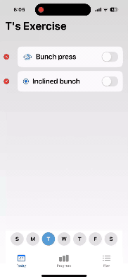

# 🏋️ Tracktrack App (SwiftUI)

A clean, lightweight iOS app to track your daily workouts, exercise plans, and progress — built with SwiftUI, JSON persistence, and Swift Charts.  
Designed for **speed**, **offline storage**, and **beautiful native animations**.

**This is 100% AI generated**,

---

## ✨ Features

- **Today Tab**  
  - View today's planned exercises
  - Mark exercises as done with a toggle
  - Delete exercises with a clean animated button
  - Random exercise icons to make it fun
  - Add exercises to multiple days of the week
  - Fully respects Safe Areas and supports Dynamic Island/iPhone 14+

- **Progress Tab**  
  - Automatically track workout history
  - See latest workout stats: weight, sets, difficulty
  - View progress charts using Swift Charts (iOS 16+)

- **Plan Tab**  
  - (Coming soon) Build and customize future workout plans

- **Data Persistence**  
  - Exercise plans saved in `excersisedata.json`
  - Workout history saved separately in `workouthistory.json`
  - No CoreData or heavy database — fast JSON-based storage

- **Animations & Visuals**
  - Native SF Symbols animations (`.bounce`, `.wiggle`)
  - Smooth delete, save, and toggle transitions
  - Custom clean UI with consistent color themes

---

---

## 🚀 Tech Stack

- Swift 5.9
- SwiftUI 5
- iOS 17+
- SF Symbols 5 (animated symbols)
- Swift Charts framework
- JSON file-based storage (no CoreData, no Realm)

---

## 🛠️ How to Run

1. Open the project in Xcode 15+
2. Set deployment target to **iOS 17.0** or above
3. Run on a simulator or real device
4. Start adding exercises and tracking your fitness!

---

## 📂 Project Structure

| Folder/File | Purpose |
|:------------|:--------|
| `TodayScreen.swift` | Main screen wrapper (TodayView + Date Picker) |
| `TodayView.swift` | Exercise list for selected day |
| `AddExerciseView.swift` | Add new exercises |
| `ExerciseDetailSheet.swift` | View and edit sets inside an exercise |
| `ProgressViewTab.swift` | See workout history and progress charts |
| `excersisedata.json` | Weekly exercise plan |
| `workouthistory.json` | Actual workout records |

---

## 📄 License

This project is licensed under the MIT License — see the [LICENSE] file for details.

---

## ❤️ Credits

Built with passion for clean UI, offline-first apps, and real-world fitness tracking by AI

---
